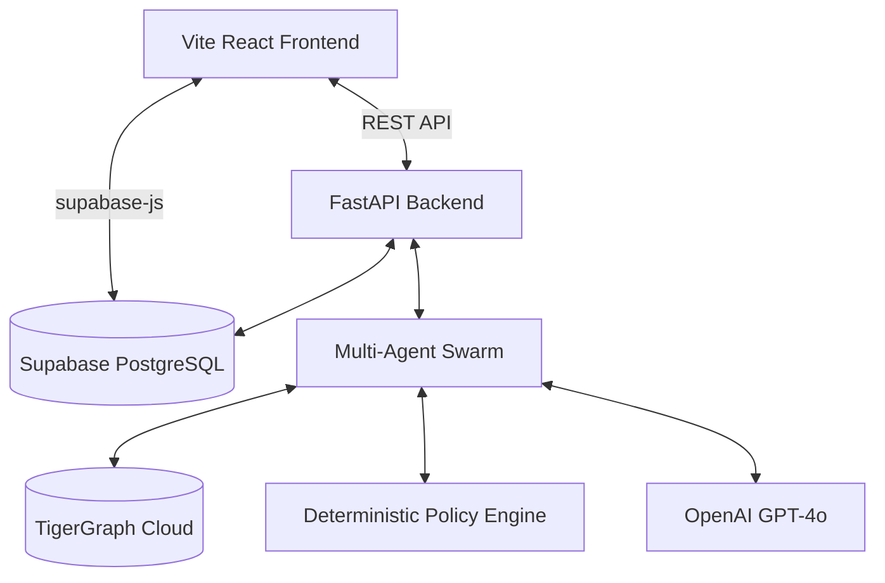

<div align="center">
  
  <h1>AEGIS SOC — Agentic Intelligence Fraud Platform</h1>
  <p>
    <b>An autonomous, production-grade Agentic Fraud Investigation & Next-Best-Action Platform.</b>
  </p>
  
  [](https://vitejs.dev/)
  [](https://reactjs.org/)
  [](https://fastapi.tiangolo.com/)
  [](https://supabase.com/)
  [](https://python.org)
</div>

<br />

AEGIS is an advanced Fraud Security Operations Center (SOC) designed to autonomously investigate financial anomalies using a Swarm of AI Agents. The platform seamlessly fuses **TigerGraph GSQL** graph traversal, **GraphRAG** reasoning, deterministic compliance policies, and a live **Supabase PostgreSQL** cloud backend.

Wrapped in an **Awwwards-Level Light Glassmorphism UI** (inspired by print editorial aesthetics), AEGIS enables analysts to visualize complex fraud networks, review AI-generated case memories, and execute mathematically defensible security actions.

---

## 🌟 Key Architecture & Features

### 1. 🐘 Live Supabase Cloud Database
- Fully migrated from local SQLite to **Supabase PostgreSQL** for production-grade, distributed case management.
- Live `cases` table tracks real-time status, risk levels, and AI confidence scores.
- Frontend includes dedicated `supabase-js` integrations for live data syncing.

### 2. 🕸️ TigerGraph & GSQL Integration
- Multi-hop graph traversal, shared device network detection, connected account discovery, and relationship pattern algorithms.
- **TigerGraph MCP Tool Layer**: Exposes deep graph tools (`inspect_customer`, `detect_shared_device_network`) directly to the LLM agent swarm.

### 3. 🤖 Specialist Multi-Agent Swarm
- **Agents:** Investigation Agent, Evidence Agent, Fraud Pattern Agent, Risk Assessment Agent, Policy Agent, Next-Best-Action Agent.
- **Safety Bounds:** Enforced deterministic limits (`MAX_AGENT_STEPS=10`, `MAX_TOOL_CALLS=15`) to prevent runaway API spend.

### 4. ⚖️ Deterministic Policy Engine
- Strict compliance rules (`POL-101`..`POL-105`) categorizing AI-recommended actions into `AUTONOMOUS_PERMITTED`, `APPROVAL_REQUIRED`, or `PROHIBITED`.
- E.g., High-risk transfers >$2,500 enforce mandatory human-in-the-loop approval.

### 5. 🎨 Cinematic Glassmorphism Frontend
- **Design Language:** Print editorial aesthetic featuring heavily frosted glass (`blur(40px)`), deep emerald green typography (`#064e3b`), and multi-layered drop shadows.
- **Typography:** Orbitron (Headers), Rajdhani (UI), Space Mono (Data).
- **Interactive Canvas:** Built-in `vis-network` relationship graph.

---

## 🏗️ System Architecture



---

## 🚀 Quick Start (Production Setup)

### 1. Environment Configuration
Create a `.env` file in the root directory and provide your live credentials:
```env
SUPABASE_URL=https://<your-project>.supabase.co
SUPABASE_KEY=<your-anon-key>
OPENAI_API_KEY=sk-...
TIGERGRAPH_HOST=https://production.i.tgcloud.io
TIGERGRAPH_SECRET=...
```

### 2. Launch Backend (FastAPI)
The backend requires `supabase` and `python-dotenv`. Upon startup, the orchestrator will automatically seed the Supabase database with initial cases if the table is empty.
```bash
pip install fastapi uvicorn pydantic supabase python-dotenv
python main.py
```
*Server will launch on `http://localhost:8000/`*

### 3. Launch Frontend (Vite)
Open a separate terminal to run the UI:
```bash
cd frontend
npm install
npm run dev
```
*App will be available at `http://localhost:3000/`*

---

## 🧪 Benchmark Suite
AEGIS includes an automated testing suite that evaluates 20 benchmark scenarios and exports JSON/CSV artifacts to `/outputs/`.
```bash
pytest backend/tests/
```

---
*Built for the future of decentralized trust.*
